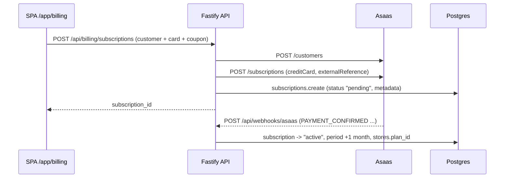

# Payment processing (Asaas)

How Luup charges merchants: plan catalog, trial, transparent credit-card
subscription, plan changes, cancellation and the webhook that keeps local
state in sync. Provider: **Asaas** (BRL, monthly credit-card recurrence).



## Plans & access gate

- Catalog: `server/src/lib/plans.ts` — `PLANS` (start 149 / growth 199 /
  pro 299 / scale 499 BRL month) is the enforcement-side constant set;
  the `plans` table (prisma/seed.ts) is the display catalog. The client
  mirrors the catalog in `client/src/pages/billing.tsx` (`plans[]`).
- Access: `server/src/lib/billing-access.ts` `storeHasBillingAccess()` —
  store must be `active` AND (trial `coalesce(trial_ends_at, created_at+7d)
  > now()` OR a subscription in `active|trialing|canceling` whose
  `current_period_end` is null/future). The widget bootstrap empties the
  video list (`trial_expired`) when this fails; the dashboard shows the
  trial/expired banners (`AppLayout` → `TrialBanner`).

## Client

| Piece | Role |
| --- | --- |
| `pages/billing.tsx` | Whole billing UI: current plan card, usage meters (`getUsageItems`), plan grid, checkout dialog, cancel dialog |
| `services/billing.service.ts` | REST wrappers + `getAccessStatus()` (trial/paid/expired derivation used by `TrialBanner`) |
| Checkout dialog (in `billing.tsx`) | Customer form (name/email/CPF-CNPJ/phone + address auto-filled from **ViaCEP** by postal code), credit-card fields, coupon input |

Client methods → routes:

- `getCurrentSubscription` → `GET /api/billing/subscription`
- `getUsage` → `GET /api/billing/usage` (active videos / month views / widgets)
- `validateCoupon` → `GET /api/billing/coupons/:code`
- `changeTrialPlan` → `POST /api/billing/trial-plan`
- `startLuupSubscription` → `POST /api/billing/subscriptions`
- `changeSubscriptionPlan` → `POST /api/billing/change-plan`
- `cancelSubscription` → `POST /api/billing/cancel-subscription`

The card data is sent to the API and forwarded to Asaas inside
`POST /subscriptions` (`creditCard` + `creditCardHolderInfo`) — the card is
**not** stored locally (see metadata below).

## Server routes (`server/src/http/billing/`, wired in `routes.ts`)

All JWT-gated (`verifyJwt`) + store-membership-checked, except the webhook.

| Route | Handler | What it does |
| --- | --- | --- |
| `GET /api/billing/subscription` | `get-subscription.ts` | Latest subscription row for the store |
| `GET /api/billing/usage` | `get-usage.ts` | `getStoreMonthlyUsage()` counters |
| `GET /api/billing/coupons/:code` | `get-coupon.ts` | Case-insensitive active-coupon lookup (null, not 404) |
| `POST /api/billing/trial-plan` | `change-trial-plan.ts` | Switches the *trialing* subscription's plan (no Asaas call): updates `plan_id`, stamps `metadata.last_trial_plan_change`, promotes `stores.plan_id` |
| `POST /api/billing/subscriptions` | `create-subscription.ts` | Transparent card flow (below) |
| `POST /api/billing/checkout` | `create-checkout.ts` | Hosted Asaas checkout session (kept from the port; **no SPA caller today**) — creates a `pending` row with `provider_checkout_id/_url` |
| `POST /api/billing/change-plan` | `change-plan.ts` | `PUT /subscriptions/{id}` on Asaas with the new value; locally sets `plan_id`, **clears all discount columns** (coupons don't carry across plans), stamps `metadata.last_plan_change` and promotes `stores.plan_id` immediately |
| `POST /api/billing/cancel-subscription` | `cancel-subscription.ts` | `DELETE /subscriptions/{id}` on Asaas; local `canceling` until period end (then `canceled`), `metadata.cancellation` audit |
| `POST /api/webhooks/asaas` | `asaas-webhook.ts` | Public; token-authenticated (below) |

Asaas HTTP goes through **`server/src/lib/asaas/`** (crm-style client:
`core/` sub-clients + `AsaasClient` facade + inspection buffers; the legacy
flat helpers `asaasRequest`/`asaasFetch`/`deleteAsaasSubscription` are
re-exported and are what the routes currently call). Hosts:
`api[-sandbox].asaas.com/v3`, auth header `access_token`.

### Create subscription (transparent card)

1. Validates customer fields (CPF/CNPJ digits, address) and the coupon
   (`is_active`, window, `max_redemptions`), then prices:

```ts
// create-subscription.ts
const discountAmount = Math.min(price, amountOff || price * percentOff / 100);
const reference = `luup:${storeId}:${planId}:${Date.now()}`; // externalReference
```

2. **Reuse path**: if the store already has an Asaas subscription in
   `active|pending|past_due`, it PUTs the existing
   `/subscriptions/{provider_subscription_id}` (updatePendingPayments) instead
   of creating a duplicate.
3. Otherwise `POST /customers` → `POST /subscriptions` with
   `billingType: "CREDIT_CARD"`, `cycle: "MONTHLY"`, `value: finalPrice`,
   `nextDueDate: today`, the card + holder info and the `externalReference`.
4. Persists locally (status starts `pending` — the webhook activates it) and
   increments `discount_coupons.redemption_count`.

## Storage (`subscriptions` table)

Written by the routes, updated by the webhook:

| Column | Source |
| --- | --- |
| `provider` | `"asaas"` |
| `plan_id`, `store_id`, `status` | `pending → active → past_due/canceling/canceled/blocked` |
| `current_period_start/_end` | set on create; webhook renews `_end = now + 1 month` on payment events |
| `provider_customer_id` / `provider_subscription_id` | Asaas `cus_*` / `sub_*` ids |
| `provider_checkout_id/_url` | hosted-checkout flow only |
| `provider_payment_id`, `provider_status` | last payment id / last raw event name |
| `discount_code/_percent/_amount`, `discount_coupon_id` | applied coupon snapshot |
| `metadata` (JSON) | `asaas_customer`, `asaas_subscription`, `customer` (form data, **no card fields**), `discount`, `external_reference`, `cancellation`, `last_trial_plan_change`, `last_asaas_event`, `last_asaas_checkout` |

`stores.plan_id` is promoted whenever a subscription becomes `active`
(webhook) and on trial plan changes — it's what plan-limit checks read.

## Webhook (`POST /api/webhooks/asaas`)

- **Auth**: shared token compared in constant time against, in order,
  `asaas-access-token`, `access_token`, `x-asaas-token`, `Authorization`
  headers. 401 on mismatch; 500 if `ASAAS_WEBHOOK_TOKEN` is unset.
- **Subscription resolution**, in order: `provider_subscription_id` →
  `provider_checkout_id` → parse `externalReference`
  (`luup:<storeId>:<planId>:…`) and take the newest row for that pair.
  Unresolvable events return `200 { ok, ignored }` so Asaas stops retrying.
- **Status mapping** (`statusFromEvent`):

```ts
PAYMENT_CONFIRMED | PAYMENT_RECEIVED | CHECKOUT_PAID
  | SUBSCRIPTION_CREATED | SUBSCRIPTION_UPDATED        -> "active" (+1 month period)
PAYMENT_OVERDUE | PAYMENT_DELETED
  | CHECKOUT_CANCELED | CHECKOUT_EXPIRED               -> "past_due"
SUBSCRIPTION_INACTIVATED | SUBSCRIPTION_DELETED        -> "canceling" (period left) / "canceled"
PAYMENT_REFUNDED | PAYMENT_CHARGEBACK_REQUESTED        -> "blocked"
```

- Every event also refreshes `provider_payment_id`, `provider_status`,
  backfills `provider_subscription_id`, and archives the raw payload into
  `metadata.last_asaas_event`.

## Environment variables (`server/src/env.ts`)

| Var | Purpose |
| --- | --- |
| `ASAAS_API_KEY` | API key sent as the `access_token` header; billing routes 500 with `missing_asaas_api_key` when unset |
| `ASAAS_ENVIRONMENT` | `sandbox` (default) / `production` — selects API + hosted-checkout hosts |
| `ASAAS_WEBHOOK_TOKEN` | Shared secret the webhook validates |
| `LUPP_APP_URL` | Builds hosted-checkout callback URLs (`/app/billing?checkout=…`) |

## Verification

- Specs: `server/src/http/billing/*.spec.ts` (Asaas stubbed via `fetch`
  mocks) and `server/src/lib/asaas/client.spec.ts` (client wiring, error
  extraction, API-key redaction in inspection buffers).
- Coupons: `discount_coupons` codes are matched case-insensitively;
  redemptions increment only after a successful Asaas subscription create.
